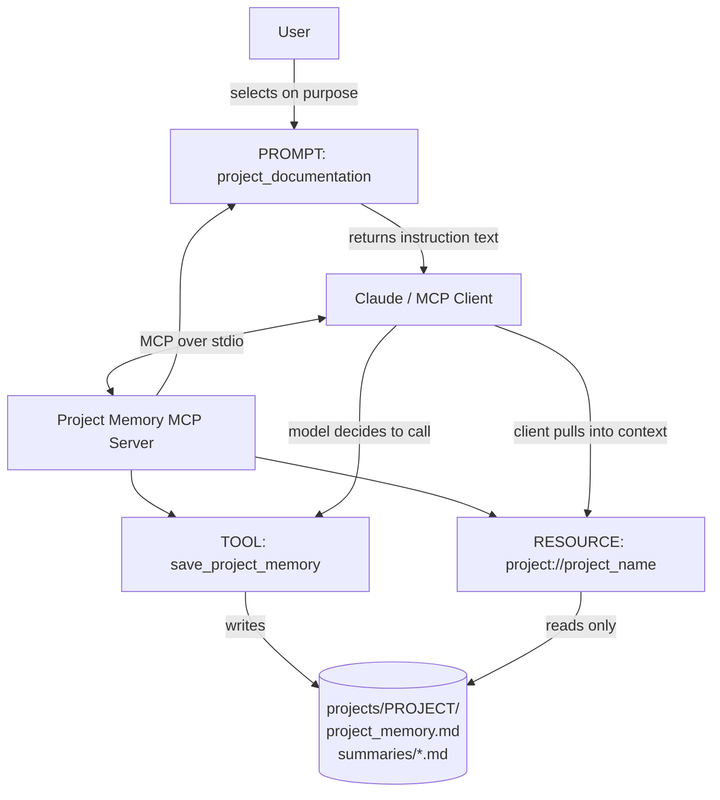

# Project Memory & Documentation MCP

A small FastMCP server that lets an AI assistant keep notes about a project in Markdown files, outside the chat window.

## 1. Problem Statement

When I work on a project with Claude over many days (for example my stock-analysis project FINITI), the important stuff ends up buried in long conversations: why I picked a technology, which bug I fixed and how, what is finished, what is still on the TODO list. A new chat starts with none of it, so I have to scroll, copy and re-explain every time.

## 2. Solution

This MCP server gives the assistant a place to store that information. Each project gets its own folder under `projects/` with a `project_memory.md` file. The assistant can save new information, read it back in a later chat, and I can ask it to structure a messy discussion into proper documentation first. It is deliberately small: no database, just Markdown files that both people and MCP clients can read.

## 3. Why MCP?

Without MCP I would have to copy and paste the notes into every chat myself. MCP is a standard way to plug capabilities into an assistant, so Claude can decide to save a note, load a project by its address, or offer a documentation template, using the same server in Claude Desktop, MCP Inspector or any other MCP client. The three MCP primitives also map neatly onto the three jobs here (act, read, instruct).

## 4. MCP Primitives

| Primitive | Name | Purpose | Why this primitive? |
| --------- | ---- | ------- | ------------------- |
| Tool | `save_project_memory` | Creates/updates `projects/<name>/project_memory.md` and a timestamped summary. | It **changes files on disk** (a side effect), and the **model decides** when to call it mid-conversation, when something worth keeping has come up. Actions the model triggers are tools. |
| Resource | `project://{project_name}` | Returns the stored memory of a project, e.g. `project://FINITI`. | It is **read-only data with an address**. The client can pull it into context without the model "doing" anything, and reading never modifies anything. Addressable data is a resource (here a resource *template*, because the name is a parameter). |
| Prompt | `project_documentation` | Instruction template that asks Claude to organize a discussion into fixed documentation sections. | It is a **reusable set of instructions the user picks on purpose** (for example from the prompt menu). It does not act and does not hold data, it only shapes how Claude writes. Saving is left to the tool. |

## 5. Architecture



More detail is in [docs/system_design.md](docs/system_design.md).

## 6. Project Structure

```
project-memory-mcp/
├── server.py                 # the MCP server: 1 tool, 1 resource, 1 prompt + helpers
├── pyproject.toml            # dependencies (fastmcp) and pytest settings
├── README.md                 # this file
├── LICENSE                   # MIT (put your name in it)
├── .gitignore                # ignores .venv, .env, caches; keeps projects/ folder
├── docs/
│   ├── system_design.md      # design, data flow, diagram
│   ├── testing.md            # how the three primitives were verified
│   └── assignment_mapping.md # requirement -> file mapping
├── projects/
│   ├── .gitkeep              # keeps the folder in git
│   └── Demo-FINITI/          # example/demo data only
└── tests/
    └── test_server.py        # local tests (no Claude needed)
```

## 7. Installation

You need Python 3.10 or newer.

```bash
git clone <your-repo-url>
cd project-memory-mcp

python -m venv .venv
```

Activate the virtual environment:

```bash
# Windows (PowerShell / cmd)
.venv\Scripts\activate

# macOS / Linux
source .venv/bin/activate
```

Install the project and the test dependency:

```bash
pip install -e ".[dev]"
```

## 8. Running the Server

```bash
python server.py
```

It uses stdio, so it sits and waits for an MCP client and prints nothing. That is normal. Normally you do not start it by hand: Claude Desktop or MCP Inspector starts it for you.

### Where memories are stored

By default in the `projects/` folder next to `server.py` (no path needed). To store them elsewhere, set the environment variable `PROJECT_MEMORY_DIR` to a folder on your PC.

### Connecting to Claude Desktop

**This is the one place where you must enter paths from your own PC.** Open Claude Desktop → Settings → Developer → Edit Config, and add:

```json
{
  "mcpServers": {
    "project-memory": {
      "command": "C:\\FULL\\PATH\\TO\\project-memory-mcp\\.venv\\Scripts\\python.exe",
      "args": ["C:\\FULL\\PATH\\TO\\project-memory-mcp\\server.py"]
    }
  }
}
```

- Replace `C:\FULL\PATH\TO\project-memory-mcp` with the folder where you cloned the project.
- On macOS/Linux use `/full/path/to/project-memory-mcp/.venv/bin/python` and `/full/path/to/project-memory-mcp/server.py`.
- In JSON, Windows backslashes must be doubled (`\\`).
- Optional, to change the storage folder: add `"env": { "PROJECT_MEMORY_DIR": "C:\\Users\\YOU\\Documents\\project-memory" }` next to `command`.
- Restart Claude Desktop completely after saving the file.

## 9. MCP Inspector Verification

With the virtual environment active, from the project folder (needs Node.js for `npx`):

```bash
npx @modelcontextprotocol/inspector python server.py
```

(`fastmcp dev server.py` also starts the Inspector in FastMCP 2.x; the command above works independent of the FastMCP version.) Open the URL it prints, click **Connect**, then:

| Primitive | Where in Inspector | What to do | Expected result |
| --------- | ------------------ | ---------- | --------------- |
| Tool | Tools → List Tools → `save_project_memory` | Enter `project_name` = `FINITI`, `conversation_summary` = any text, click Run Tool | `status: success` and `projects/FINITI/project_memory.md` now exists |
| Resource | Resources → Resource Templates → `project://{project_name}` | Enter `FINITI`, click Read | The saved Markdown; for an unknown name: "…does not exist yet." |
| Prompt | Prompts → `project_documentation` | Enter `project_name` = `FINITI`, click Get Prompt | A message with the 12 documentation sections and the rules |

Full step-by-step checklist with expected outputs and a place for screenshots: [docs/testing.md](docs/testing.md).

Automated tests (they also check that the server exposes exactly 1 tool, 1 resource template and 1 prompt):

```bash
python -m pytest
```

## 10. Example Workflow

1. I talk to Claude about FINITI: features, tech choices, problems.
2. I select the **`project_documentation`** prompt (project name `FINITI`). Claude turns the discussion into structured Markdown and marks missing information instead of guessing.
3. I read it and agree it is worth keeping. Claude decides to persist it and calls the **`save_project_memory`** tool with the summary, decisions, technologies, status and next steps.
4. The server writes `projects/FINITI/project_memory.md` and `projects/FINITI/summaries/<date>-summary.md` and returns:

```json
{
  "status": "success",
  "project": "FINITI",
  "path": "projects/FINITI/project_memory.md",
  "summary_file": "projects/FINITI/summaries/2026-09-30-143856-summary.md",
  "message": "Project memory saved successfully."
}
```

5. Days later, in a new chat, I attach the **`project://FINITI`** resource. Claude gets the earlier project context and continues where we stopped.

## 11. Security / Safety

- No secrets or API keys are used. `.env` and `.env.*` are in `.gitignore`.
- Project names are sanitized: `/`, `\`, `.` and other special characters are replaced, so `../../something` becomes `something`. The final folder is also checked to be inside `projects/`.
- Storage is local only. Nothing is sent over the network.
- The server can only read and write `project_memory.md` and summary files inside the projects folder. There is no tool for arbitrary file access, and the resource is read-only.
- Memories you save for your own projects are git-ignored by default (see `.gitignore`), so private notes are not pushed by accident.

## 12. Assignment Requirement Mapping

| Assignment Requirement | Implementation |
| ---------------------- | -------------- |
| One Tool | `server.py` → `save_project_memory` |
| One Resource | `server.py` → `project://{project_name}` |
| One Prompt | `server.py` → `project_documentation` |
| Docstrings for all three | `server.py` (each primitive) |
| README with use case and WHY | `README.md` sections 1–4 |
| System design | `docs/system_design.md` (and section 5 above) |
| Project structure | `README.md` section 6 |
| Dependencies | `pyproject.toml` |
| No secrets | `.gitignore` (`.env`, `.env.*`), no secrets in code |
| Live verification | `docs/testing.md`, `tests/test_server.py` |

The detailed version is in [docs/assignment_mapping.md](docs/assignment_mapping.md).
