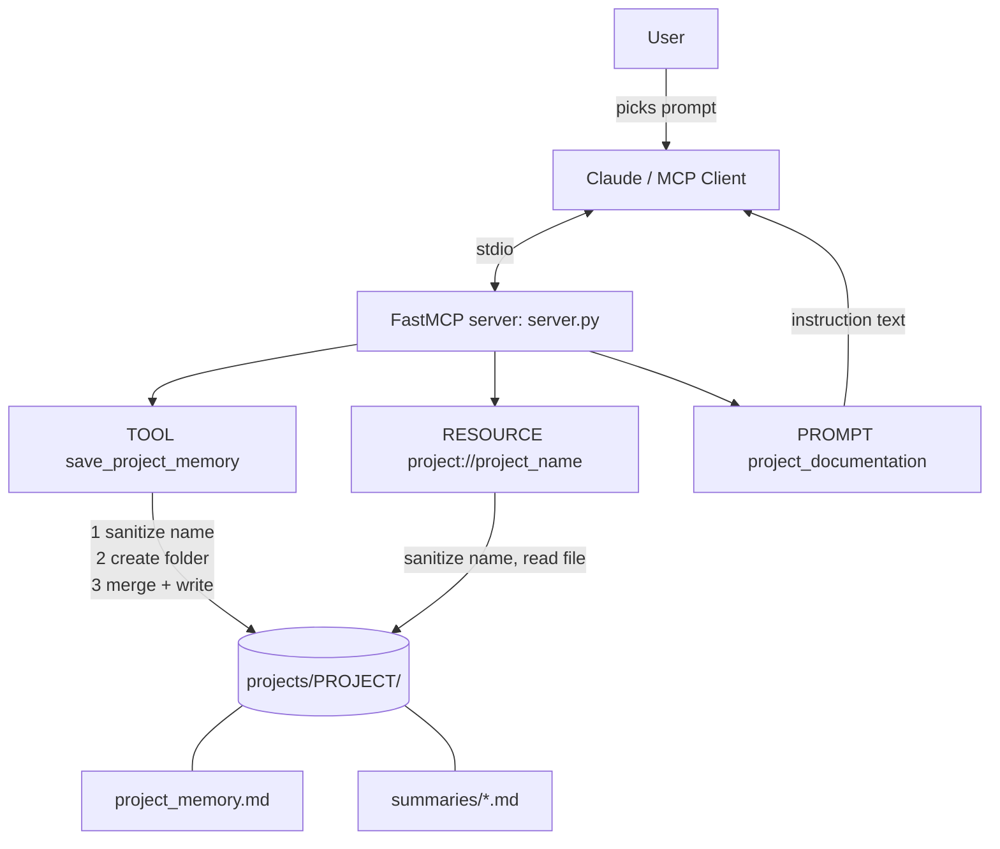

# System Design

## Problem

Useful project knowledge (decisions, bugs and fixes, status, TODOs) stays trapped inside long chat conversations and is lost when a new chat starts.

## Users

- **Developer/student (the user):** talks to Claude about projects and chooses the documentation prompt.
- **The assistant (Claude):** decides when to save information and reads it back later.

## Components

| Component | Role |
| --------- | ---- |
| MCP client | Claude Desktop or MCP Inspector. Starts the server and talks to it over stdio. |
| MCP server | `server.py`, built with FastMCP. Exposes exactly 3 primitives. |
| Tool `save_project_memory` | Inputs: project name plus text fields (summary, requirements, technologies, decisions, status, problems/solutions, future improvements, next steps). Writes Markdown. Returns a structured result. |
| Resource `project://{project_name}` | Input: project name in the URI. Returns the stored Markdown. Read-only. |
| Prompt `project_documentation` | Inputs: project name, optional conversation text. Returns instruction text. No side effects. |
| Filesystem | `projects/<project>/project_memory.md` and `projects/<project>/summaries/<timestamp>-summary.md`. |

## Diagram

## Data flow

**Saving (tool):** the model calls `save_project_memory` → the name is sanitized → the project folder is created if needed → the existing `project_memory.md` is parsed (if any) → new non-empty fields replace old ones, empty fields keep the old value (or show `Not provided`) → the file is rewritten → a timestamped summary of what was just submitted is written → a `SaveResult` is returned.

**Reading (resource):** the client requests `project://FINITI` → the name is sanitized → the file is read and returned as `text/markdown`. If it does not exist, the text "Project memory for 'FINITI' does not exist yet." is returned. Nothing is written.

**Documenting (prompt):** the user selects `project_documentation` and fills in the project name (and optionally pastes the discussion) → the server returns instruction text → Claude writes the structured document. The prompt never touches the filesystem.

## Design decisions

- **Markdown files, not a database:** easy to read, edit and diff, and it keeps the assignment simple.
- **One folder per project:** projects cannot mix.
- **Merge on update:** a later save that only mentions "current status" does not wipe the earlier decisions.
- **Summaries folder:** each save leaves a small timestamped file, so there is a history of what was added.
- **Core logic in plain functions:** `save_memory`, `read_memory` and `build_documentation_prompt` hold the logic; the decorated MCP functions are thin wrappers. This makes them easy to test without Claude.
- **Sanitized names:** prevents path traversal.

## Example workflow

See section 10 of the [README](../README.md).
